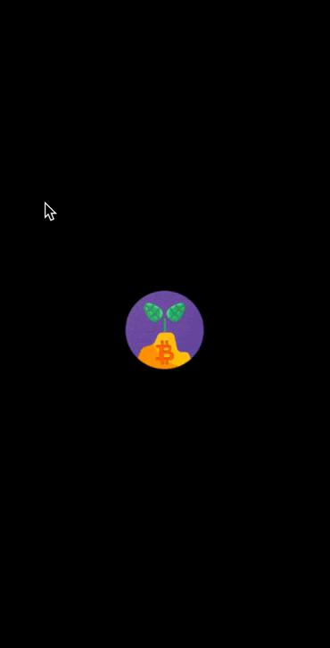

# CryptoStats

Android application about a cryptocurrency tracker, where you can follow any crypto you are interested in.

 

  

#### The app has following packages:
1. **common**: It contains common components.
2. **data**: It contains all the data accessing and manipulating components.
3. **di**: Dependency providing classes using Dagger2.
4. **domain**: It contains domain and model objects.
6. **ui**: View classes along with their corresponding ViewModel.
7. **utils**: Utility classes.

#### This is a MVVM kotlin project with Jetpack and I used the following libraries and components:
1. **Retrofit** to consume REST API. In particular I used Lunar and Nomics API to get all crypto information such as name, price, news etc. 
2. **Room** to create a local database, where App can save user preferences as settings and crypto watchlist
3. **WorkManager** to schedule asynchronous and repeatedly tasks. In particular, it has been used to create background tasks that alert the user just any following crypto gets an increase/decrease greater than a specific percentage.
4. **DaggerHilt** to use dependency injection along with Retrofit and Room
5. **Navigation** to navigate between destinations within the App, such as between action bar sections and within them
6. **ViewModel** to save and manage UI data
7. **LiveData** to create observable objects that respects lifecycle of other app components
8. **Coroutines** to convert async callbacks for long-running tasks into sequential code

  
 
 

