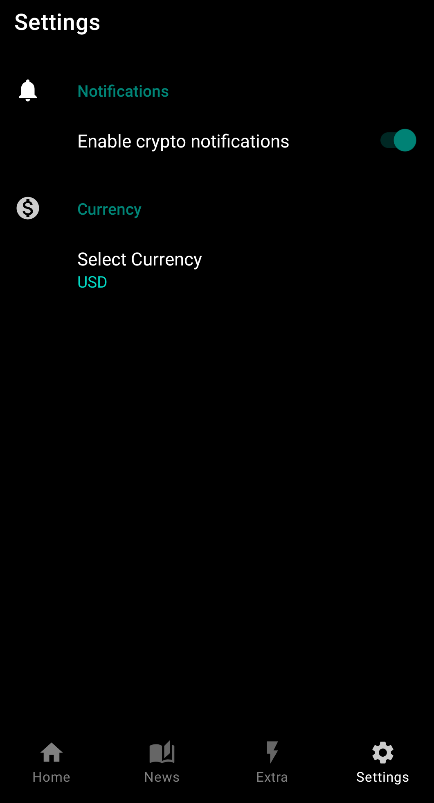

# CryptoStats

Android application about a cryptocurrency tracker, where you can follow any crypto you are interested in.

 

  
  
  
  
  
  
  
  

I used the following libraries and components:
- #Retrofit to consume REST API. In particular I used Lunar and Nomics API to get all crypto information such as name, price, news etc. 
-#Room to create a local database, where App can save user preferences as settings and crypto watchlist
-#WorkManager to schedule asynchronous and repeatedly tasks. In particular, it has been used to create background tasks that alert the user just any following crypto gets an increase/decrease greater than a specific percentage.
-I also used #DaggerHilt , #Navigation, #ViewModel , #LiveData and #Coroutines

#### The app has following packages:
1. **data**: It contains all the data accessing and manipulating components.
2. **di**: Dependency providing classes using Dagger2.
3. **ui**: View classes along with their corresponding ViewModel.
4. **utils**: Utility classes.
